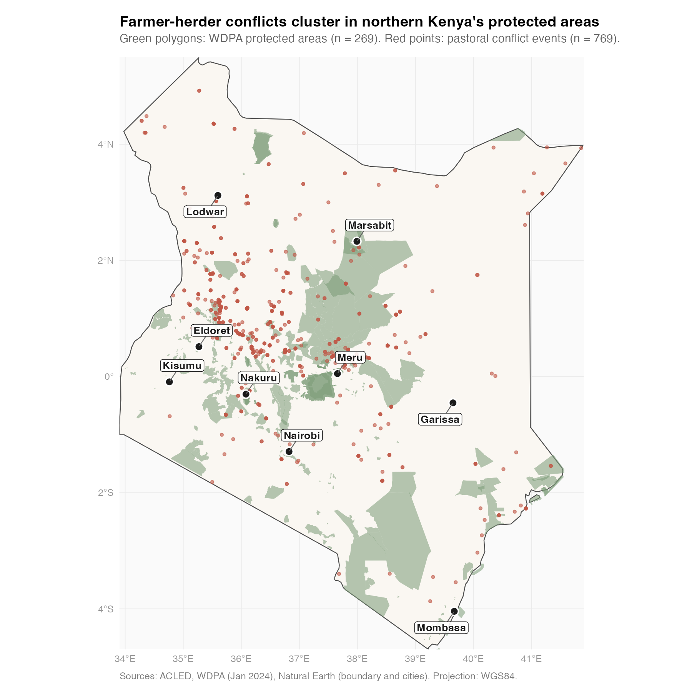
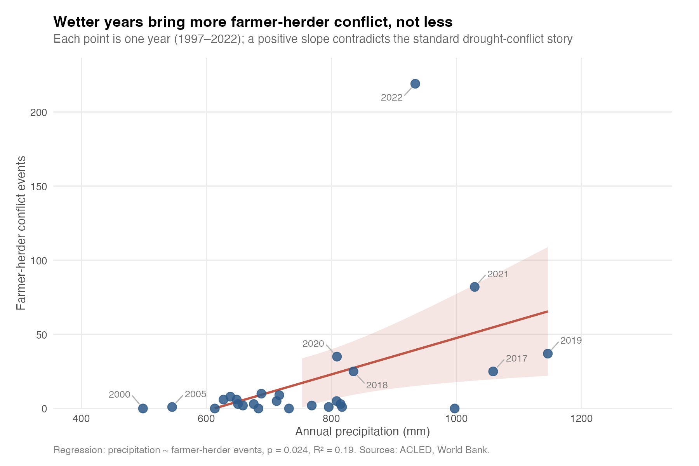

# Climate, protected areas, and pastoral conflict in Kenya

A reproducible analysis of how rainfall, vegetation, and protected-area boundaries shape conflict patterns in Kenya, using three conflict datasets (ACLED, UCDP, NRT) and satellite-derived environmental indicators.

Based on my undergraduate senior thesis at Princeton University's School of Public and International Affairs (May 2024), rebuilt end-to-end in R with full spatial analysis in `sf`.



## Key findings

**The standard climate-conflict story does not hold in Kenya.** Across nearly three decades of data, wetter years are associated with more pastoral conflict, not fewer. This pattern is consistent with livestock-raiding as the underlying mechanism: wet years produce fatter herds and better raiding conditions, rather than the resource scarcity that classical models predict.

**The relationship reverses in election years.** In non-election years there is a modest positive slope between vegetation greenness (NDVI) and conflict. In election years the direction reverses: greener vegetation is associated with sharply fewer conflicts. The interaction is statistically significant (adjusted R² = 0.41, interaction p = 0.016), though the sample size is small (n = 21 years).

**Conflict concentrates in specific protected-area types.** Community Nature Reserves see an average of 21 conflict events each, an order of magnitude more than National Parks (1.4) or Community Conservancies (0.4). Northern Kenya's community conservancies and major forest reserves account for most of the pastoral violence recorded.



## Repository structure

```
kenya-pastoral-violence/
├── R/                           # Analytical scripts, run in order
│   ├── 01_load_spatial_data.R   # Load conflict datasets and WDPA polygons as sf objects
│   ├── 02_spatial_joins.R       # Count events inside each protected area
│   ├── 03_regression_analysis.R # Climate-conflict and designation regressions
│   └── 04_visualisations.R      # Produce figures for this README
├── data/
│   ├── raw/                     # Original datasets (some gitignored; see Data sources)
│   └── processed/               # Derived datasets and analysis outputs
├── figures/                     # PNG outputs from 04_visualisations.R
├── docs/
│   └── thesis.pdf               # Full 107-page thesis with methodology and references
├── renv.lock                    # Pinned R package versions
└── kenya-pastoral-violence.Rproj
```

## How to reproduce

Clone the repo, open `kenya-pastoral-violence.Rproj` in RStudio, and run the scripts in order:

```r
renv::restore()          # install pinned package versions
source("R/01_load_spatial_data.R")
source("R/02_spatial_joins.R")
source("R/03_regression_analysis.R")
source("R/04_visualisations.R")
```

Alternatively, `source("run_all.R")` runs the full pipeline in one step.

Requires R 4.2+ and the spatial system libraries (GDAL, GEOS, PROJ) that `sf` depends on. On macOS, install these with Homebrew (`brew install gdal geos proj`) before installing `sf`.

Three datasets need to be downloaded separately (see the Data sources section below). The scripts will error with clear messages if any of them are missing.

## Data sources

| Dataset | Coverage | Source | In repo? |
|---|---|---|---|
| ACLED conflict events | Kenya, 1997 to January 2024 | [acleddata.com](https://acleddata.com) | No (registration required, redistribution prohibited) |
| UCDP Georeferenced Event Dataset | Global, 1989 to 2023 | [ucdp.uu.se](https://ucdp.uu.se/downloads/) | Yes |
| NRT (Northern Rangelands Trust) events | Northern Kenya, 2018 to September 2022 | Private research communication | No |
| WDPA protected areas | Kenya, January 2024 | [protectedplanet.net](https://www.protectedplanet.net/) | Yes |
| World Bank Climate Change Knowledge Portal precipitation | Kenya, annual | [climateknowledgeportal.worldbank.org](https://climateknowledgeportal.worldbank.org/) | Yes |
| NDVI (NASA MODIS Collection 6.1) | Kenya, monthly, 2002 to 2024 | [Humanitarian Data Exchange](https://data.humdata.org) | Yes |
| McGuirk & Nunn transhumant pastoralism data | Africa, ethnographic grid cells | [Zenodo replication package](https://zenodo.org/records/20767114) | No (227 MB file exceeds GitHub's size limit; download from Zenodo) |

**Data availability notes:**

*ACLED* requires free registration but does not permit redistribution. To reproduce this analysis, register at acleddata.com, download Kenya events from 1997 to present, and save the file to `data/raw/acled_kenya_1997_2024.csv`.

*NRT* data was obtained through a personal research communication and is not publicly redistributable. The available snapshot (dated September 2022) covers 2018 to mid-2022, which is why NRT time-series regressions are omitted from `03_regression_analysis.R`. Five years is too few for annual regression. NRT still contributes to the cross-sectional protected-area analysis, where year coverage is not required. My original thesis used a later NRT export with additional years, and the qualitative findings replicate on the available snapshot.

*McGuirk & Nunn replication data* is a 227 MB Stata file that exceeds GitHub's 100 MB file size limit. Download it from the Zenodo link above and save to `data/raw/nunn_mcguirk_replication.dta`.

The derived dataset `data/processed/annual_climate_conflict_index.csv` combines yearly precipitation, a categorical precipitation index (high, medium, or low) that I compiled from news articles and policy reports, election-year indicators, and conflict counts across all three datasets. This is an original data product built for the thesis.

## Methodology summary

**Spatial joins** ([`02_spatial_joins.R`](R/02_spatial_joins.R)). Conflict events (points) are joined to WDPA protected areas (polygons) via `st_intersects`, projected to Arc 1960 / UTM zone 37S (EPSG:21037) for accurate area calculation. Multipart polygons sharing a WDPAID are dissolved before joining to avoid double-counting.

**Climate to conflict regressions** ([`03_regression_analysis.R`](R/03_regression_analysis.R)). Annual conflict counts are regressed on precipitation, a categorical precipitation index, and NDVI, each interacted with an election-year indicator. Sample sizes are small (n = 21 to 34 years), so results should be read as exploratory patterns rather than identified causal effects.

**Protected-area designation model.** Conflict counts and area-normalised conflict density are regressed on WDPA designation type, with Community Conservancy as the reference category. The raw-count model has adjusted R² = 0.25 with Community Nature Reserve highly significant, while the area-normalised model has near-zero R². This indicates that much of the raw-count difference reflects the size of the protected area rather than the density of conflict within it.

**Farmer-herder identification.** ACLED events are classified as pastoral if `assoc_actor_1`, `assoc_actor_2`, or the `notes` field matches "pastoralists" or "herders" (case-insensitive). This yields 769 events, roughly 6% of Kenyan ACLED events across 1997 to 2024.

## Limitations

- **Small annual samples.** Climate to conflict regressions have n = 21 to 34 years. Findings should be treated as exploratory patterns rather than identified causal effects.
- **NRT snapshot coverage.** The available NRT data covers only 2018 to September 2022, which limits analyses that depend on full year coverage.
- **Point geocoding.** Conflict events are recorded at approximate incident locations, and some are geocoded to district centroids. This introduces spatial noise into the point-in-polygon joins.
- **ACLED coverage over time.** ACLED coverage in Kenya deepened materially after 2015, so year-on-year comparisons of raw counts partly reflect improved reporting rather than only underlying conflict.

## About

Built by [Meera Burghardt](https://www.linkedin.com/in/meera-burghardt/), MPA candidate in Data Science for Public Policy at the London School of Economics.

The original thesis was supervised by Professor Ethan Kapstein at the Princeton School of Public and International Affairs, and presented to Kenyan policymakers, government officials, and protected-area managers in May 2024. The full 107-page thesis is available at [`docs/thesis.pdf`](docs/thesis.pdf).